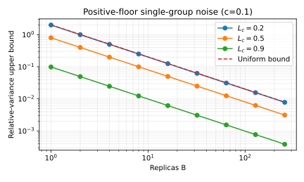
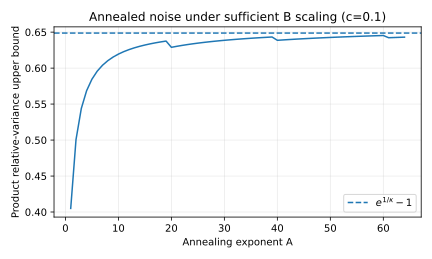
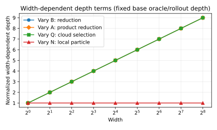
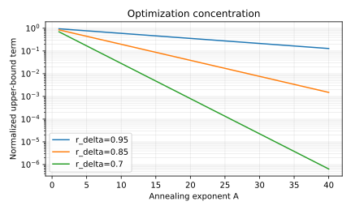

# Massively Parallel TPU RL with MPBRI

## Rust reproducibility package for the theoretical figures

This repository contains the Rust implementation used to reproduce the **intrinsic theoretical figures** for the MPBRI reinforcement-learning method developed in the manuscript:

> **Massively Parallel Pseudo-Marginal Inference for Fixed-Data Posterior-Predictive Policy Optimization**

The purpose of this repository is **reproducibility of our method**. The code regenerates the theoretical scaling, estimator-noise, parallel-depth, and annealing-concentration figures directly from the identities and bounds proved in the manuscript.

These are **theoretical reproducibility figures**, not baseline experiments or empirical learning curves.

The implementation is deliberately small and dependency-free. The plotting program uses only the Rust standard library and writes vector SVG figures directly. The corresponding manuscript PDF figures are included alongside them for comparison.

---

## Figures reproduced

### 1. Positive-floor likelihood noise

For a bounded likelihood variable \(X\in[c,1]\) with mean \(L_c\),

$$
\operatorname{Var}(X)\le (1-L_c)(L_c-c).
$$

Hence,

$$
\frac{\operatorname{Var}(\widehat L_{c,B})}{L_c^2}
\le
\frac{(1-L_c)(L_c-c)}{B L_c^2}
\le
\frac{(1-c)^2}{4Bc}.
$$

The figure uses \(c=0.1\). The degenerate curve \(L_c=c\), whose bound is identically zero, is omitted from the logarithmic axis.

<p align="center">
  <a href="figures/relative_noise.pdf">
    
  </a>
</p>

<p align="center">
  <a href="figures/relative_noise.svg">SVG</a>
  &nbsp;|&nbsp;
  <a href="figures/relative_noise.pdf">PDF</a>
</p>

---

### 2. Annealed product-estimator noise

For \(A\) independent annealing groups, the product estimator satisfies

$$
\frac{\operatorname{Var}(\widehat L_{c,A,B})}{L_c^{2A}}
=
(1+v_B)^A-1.
$$

Using the sufficient replica scaling

$$
B\ge
\kappa A\frac{(1-c)^2}{4c}
$$

gives

$$
(1+v_B)^A-1
\le
\exp(1/\kappa)-1.
$$

The reproduced figure uses \(c=0.1\) and \(\kappa=2\).

<p align="center">
  <a href="figures/annealed_noise.pdf">
    
  </a>
</p>

<p align="center">
  <a href="figures/annealed_noise.svg">SVG</a>
  &nbsp;|&nbsp;
  <a href="figures/annealed_noise.pdf">PDF</a>
</p>

---

### 3. Massively parallel TPU depth scaling

The width-dependent part of the MPBRI parallel-depth bound is

$$
\log B+\log A+\log Q.
$$

The remaining sequential base term,

$$
D_\phi + H(D_\pi+D_P)+r d_\theta,
$$

is held fixed in this figure.

The plot visualizes the logarithmic contribution of rollout replication \(B\), annealing width \(A\), and multiple-try width \(Q\). The local population width \(N\) introduces no additional per-particle depth term when no global reduction is performed.

<p align="center">
  <a href="figures/depth_components.pdf">
    
  </a>
</p>

<p align="center">
  <a href="figures/depth_components.svg">SVG</a>
  &nbsp;|&nbsp;
  <a href="figures/depth_components.pdf">PDF</a>
</p>

---

### 4. Annealing concentration toward the RL optimizer set

The optimization-concentration theorem contains the normalized factor

$$
r_\delta^A,
\qquad
r_\delta
=
\frac{L_c^\star-\delta}
     {L_c^\star-\delta/2}
<1.
$$

The figure shows the exponential decay of \(r_\delta^A\) for representative values

$$
r_\delta\in\{0.95,0.85,0.70\}.
$$

<p align="center">
  <a href="figures/annealing_bound.pdf">
    
  </a>
</p>

<p align="center">
  <a href="figures/annealing_bound.svg">SVG</a>
  &nbsp;|&nbsp;
  <a href="figures/annealing_bound.pdf">PDF</a>
</p>

---

## Reproduce all figures

Install a stable Rust toolchain and run from the repository root:

```text
cargo run --release
```

The command deterministically regenerates the four SVG files in `figures`.

No external crates, Python packages, plotting libraries, datasets, network access, random seeds, or baseline implementations are required.

---

## Mathematical provenance

The figures visualize identities or bounds proved in the manuscript:

1. **Positive-floor likelihood noise**

   $$
   \operatorname{Var}(X)\le (1-L_c)(L_c-c).
   $$

2. **Independent annealing groups**

   $$
   \frac{\operatorname{Var}(\widehat L_{c,A,B})}{L_c^{2A}}
   =
   (1+v_B)^A-1.
   $$

3. **Sufficient replica scaling**

   $$
   B\ge
   \kappa A\frac{(1-c)^2}{4c}
   \quad\Longrightarrow\quad
   (1+v_B)^A-1
   \le
   e^{1/\kappa}-1.
   $$

4. **Massively parallel TPU depth**

   The width-dependent component is

   $$
   \log B+\log A+\log Q.
   $$

5. **Annealing concentration**

   $$
   r_\delta^A,
   \qquad
   r_\delta=
   \frac{L_c^\star-\delta}
        {L_c^\star-\delta/2}<1.
   $$

---

## Repository layout

```text
Massively-Parallel-TPU-RL-MPBRI/
  Cargo.toml
  LICENSE
  README.md
  src/
    main.rs
  figures/
    relative_noise.svg
    relative_noise.pdf
    annealed_noise.svg
    annealed_noise.pdf
    depth_components.svg
    depth_components.pdf
    annealing_bound.svg
    annealing_bound.pdf
```

There are intentionally **no hidden dot-files or dot-directories** in this repository.

---

## Scope

This repository accompanies the **Massively Parallel TPU RL MPBRI** method and is intended specifically for reproducibility of the manuscript's theoretical figures.

It contains:

- the Rust implementation of the plotting logic;
- the exact analytical expressions used for the plots;
- the generated SVG figures; and
- the corresponding manuscript PDF figures.

It does **not** contain baseline experiments, training datasets, or empirical learning curves. Those are separate from the intrinsic theoretical scaling laws reproduced here.

---

## Reproducibility statement

Every plotted curve is generated directly from a closed-form identity or bound stated in the manuscript.

Running the Rust program therefore reconstructs the theoretical figures without stochastic simulation, model fitting, hidden preprocessing, or external plotting software.
